# ROS2 ICP + EKF Localization — Differential-Drive AMR

**Scan-to-Map ICP · Wheel Odometry · IMU Fusion · Nav2 · Ground Truth Benchmark**  
Custom localization pipeline for a differential-drive AMR, implemented and evaluated in ROS2 Humble / C++17.

---

## Overview

This project implements a localization pipeline for an Autonomous Mobile Robot (AMR) using **2D LiDAR, wheel odometry, IMU, custom ICP scan matching, and a custom Extended Kalman Filter (EKF)**.

The main objective is not simply to run an existing localization package, but to directly implement and evaluate the internal localization process:

```text
Wheel Odometry
      +
2D LiDAR Scan-to-Map ICP
      +
IMU
      ↓
Custom EKF
      ↓
[x, y, yaw]
```

The system is integrated with Nav2 and evaluated against Gazebo Ground Truth using an automated **START → P1 → P2 → P3** benchmark.

**Key highlights:**

- **Custom 2D Scan-to-Map ICP** implemented in C++17
- Dynamic **`map -> odom`** correction from ICP
- **Custom EKF** with state `[x, y, yaw]`
- EKF prediction using **wheel odometry + IMU yaw rate**
- ICP global pose used as the EKF measurement update
- Nav2 navigation integrated **without AMCL**
- Automated Ground Truth benchmark with CSV logging
- **4 repeated runs** under the same route and simulation conditions
- Final mean Position RMSE:
  - Wheel Odometry: **0.0704 m**
  - ICP: **0.04288 m**
  - ICP + EKF: **0.04211 m**
- EKF reduced ICP Yaw RMSE by approximately **60.1%**

---

## Results at a Glance

The main benchmark figures are embedded directly from `results/benchmark_02/`.

<table>
<tr>
<td width="50%" align="center">
<b>Trajectory Comparison</b><br><br>
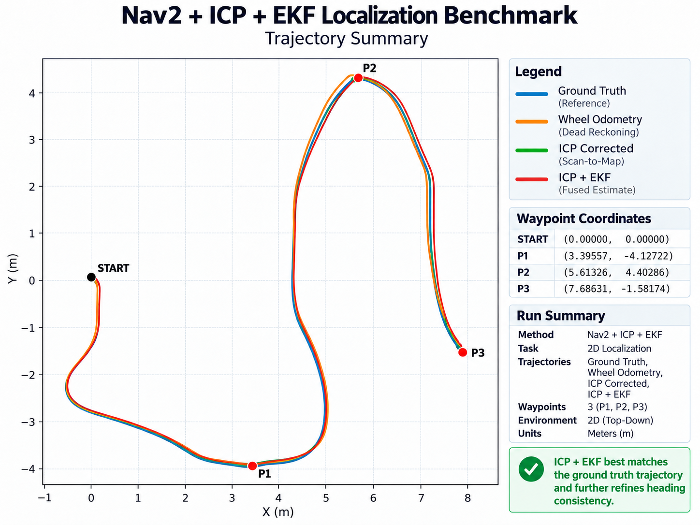
</td>
<td width="50%" align="center">
<b>Error Analysis</b><br><br>
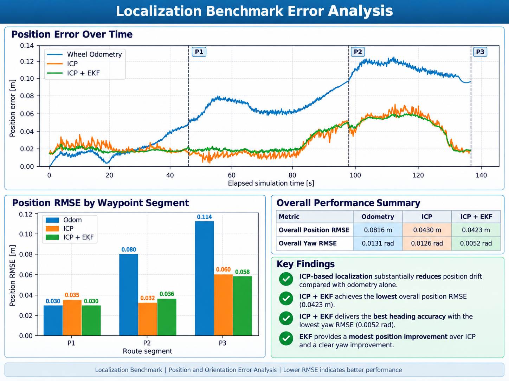
</td>
</tr>
<tr>
<td width="50%" align="center">
<b>4-Run Mean Position RMSE</b><br><br>
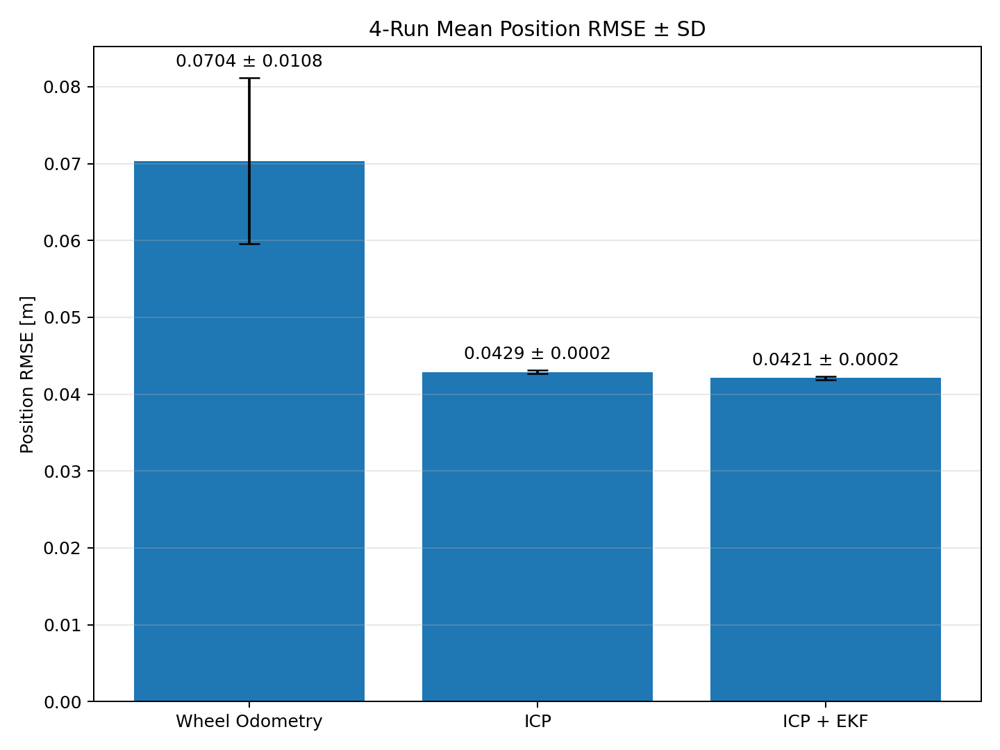
</td>
<td width="50%" align="center">
<b>4-Run Mean Yaw RMSE</b><br><br>
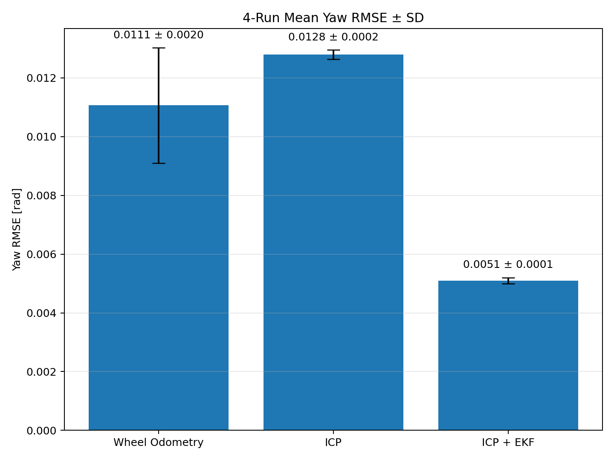
</td>
</tr>
</table>

Additional detailed plots:

- [Position Error Over Time](results/benchmark_02/position_error_time.png)
- [Yaw Error Over Time](results/benchmark_02/yaw_error_time.png)
- [Position RMSE Comparison](results/benchmark_02/position_rmse_comparison.png)
- [Yaw RMSE Comparison](results/benchmark_02/yaw_rmse_comparison.png)
- [Segment Position RMSE](results/benchmark_02/segment_position_rmse.png)
- [Segment Yaw RMSE](results/benchmark_02/segment_yaw_rmse.png)


---

## System Architecture

> *Simulation → Localization → Fusion → Navigation → Evaluation*

```text
┌─────────────────────────────────────────────────────────────┐
│                     Gazebo Fortress                         │
│                                                             │
│   DiffDrive        2D LiDAR          IMU       Ground Truth │
└──────┬───────────────┬───────────────┬──────────────┬───────┘
       │               │               │              │
       v               v               v              v
    /odom            /scan           /imu    /ground_truth_pose
       │               │               │              │
       │        ┌──────▼────────┐      │              │
       │        │  Custom ICP   │      │              │
       │        │ Scan-to-Map   │      │              │
       │        └──────┬────────┘      │              │
       │               │               │              │
       │       map -> odom TF           │              │
       │               │               │              │
       │          /icp_pose             │              │
       │               │               │              │
       └───────────────┬┴───────────────┘              │
                       v                               │
                ┌───────────────┐                      │
                │  Custom EKF   │                      │
                │ [x, y, yaw]   │                      │
                └──────┬────────┘                      │
                       │                               │
                 /ekf_pose                             │
                 /ekf_odom                             │
                       │                               │
         ┌─────────────┴─────────────┐                 │
         │                           │                 │
         v                           v                 │
      Nav2                     Benchmark Runner <──────┘
 Planning / Control          Odom / ICP / EKF Error
         │                           │
         v                           v
     /cmd_vel                 CSV / RMSE / Plots
```

### Validated TF Structure

```text
map
 |
 |  Custom ICP
 v
odom
 |
 |  Wheel Odometry
 v
base_footprint
 |
 v
base_link
 ├── laser_link
 ├── imu_link
 ├── left_wheel_link
 └── right_wheel_link
```

> **Current benchmark architecture:** Nav2 uses the ICP-owned `map -> odom` TF.  
> The EKF is evaluated in parallel through `/ekf_pose`; it is not yet the sole TF authority.

---

## Features

### Localization — Custom 2D Scan-to-Map ICP

The ICP node aligns the current LiDAR scan against points extracted from a saved occupancy map.

```text
LaserScan
   ↓
2D Scan Points
   ↓
laser_link -> odom
   ↓
odom -> map
   ↓
Nearest-Neighbor Search
   ↓
Correspondence Filtering
   ↓
2D Rigid Transform
   ↓
Iterative Update
   ↓
map -> odom
```

**Implementation details:**

| Item | Value |
|---|---:|
| LiDAR samples | 360 |
| LiDAR update rate | 10 Hz |
| Scan range | 0.10–10.0 m |
| Nearest-neighbor method | Brute-force |
| Max correspondence distance | 0.15 m |
| Maximum ICP iterations | 10 |
| Translation convergence | 0.001 m |
| Rotation convergence | 0.001 rad |

The rigid correction is estimated from matched source / target point pairs and iteratively composed into the internal `map_to_odom` transform.

---

### Sensor Fusion — Custom EKF

The EKF state is:

```text
[x, y, yaw]
```

**Prediction input:**

```text
Wheel Odometry
- linear.x

IMU
- angular_velocity.z
```

**Measurement input:**

```text
Custom ICP
- global x
- global y
- global yaw
```

Prediction model:

```text
x(k+1)   = x(k)   + v cos(yaw) dt
y(k+1)   = y(k)   + v sin(yaw) dt
yaw(k+1) = yaw(k) + omega dt
```

The implementation includes:

- State prediction
- Jacobian-based covariance propagation
- ICP innovation calculation
- Yaw residual normalization
- Kalman gain
- Measurement update
- Joseph-form covariance update

Initial tuning values:

| Parameter | Value |
|---|---:|
| Process noise XY | 0.02 |
| Process noise yaw | 0.02 |
| Initial std XY | 0.05 |
| Initial std yaw | 0.03 |
| ICP measurement std XY | 0.05 |
| ICP measurement std yaw | 0.03 |

---

### Navigation — Nav2 with Custom Localization

Nav2 is used for:

- Global planning
- Local costmap
- Obstacle avoidance
- DWB local control
- `NavigateToPose`

AMCL is intentionally excluded from the benchmark.

```text
Custom ICP
    ↓
map -> odom
    ↓
Nav2
    ↓
/cmd_vel
    ↓
Gazebo AMR
```

---

## Implementation & Validation Evidence

The images in `docs/images/` document the implementation and validation process.  
The figures in `results/benchmark_02/` are reserved for the final quantitative evaluation.

### Robot Model & Differential Drive

<table>
<tr>
<td width="50%" align="center">
<b>RViz2 Robot Model Validation</b><br><br>
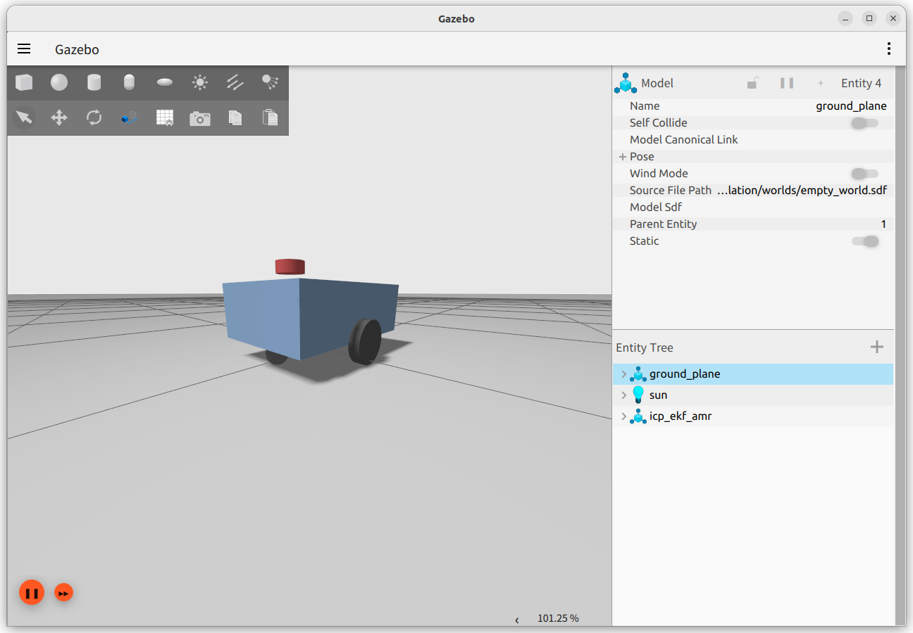
</td>
<td width="50%" align="center">
<b>Differential Drive — Straight Motion</b><br><br>
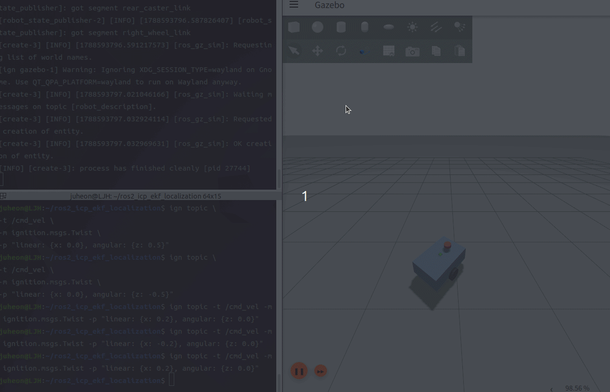
</td>
</tr>
<tr>
<td width="50%" align="center">
<b>Differential Drive — Rotation</b><br><br>
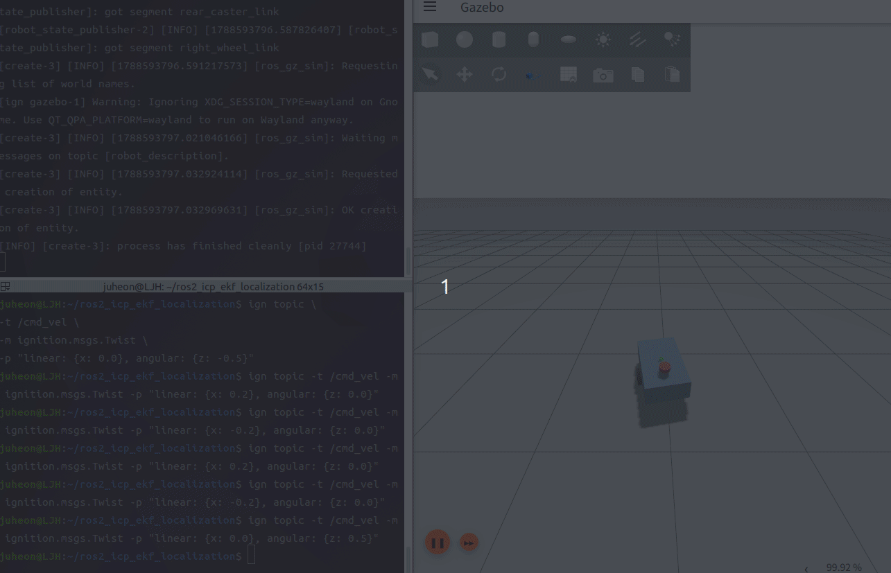
</td>
<td width="50%" align="center">
<b>ROS2 ↔ Gazebo Bridge</b><br><br>
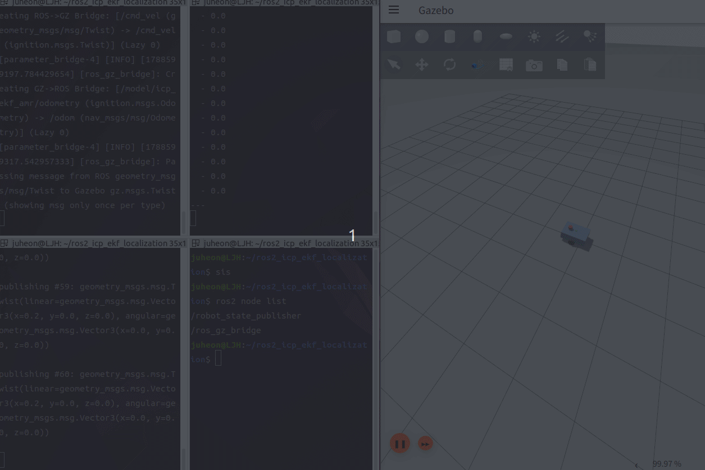
</td>
</tr>
</table>

### Joint State & LiDAR Validation

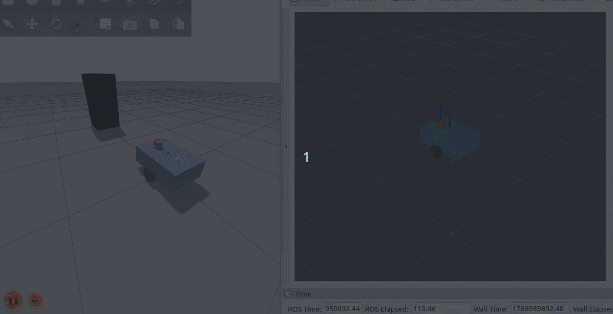

This stage verifies that the simulated wheel joint states and LiDAR scan are correctly bridged into ROS2 and visualized in RViz2.

### Evaluation World & Mapping

<table>
<tr>
<td width="50%" align="center">
<b>Localization Benchmark World</b><br><br>
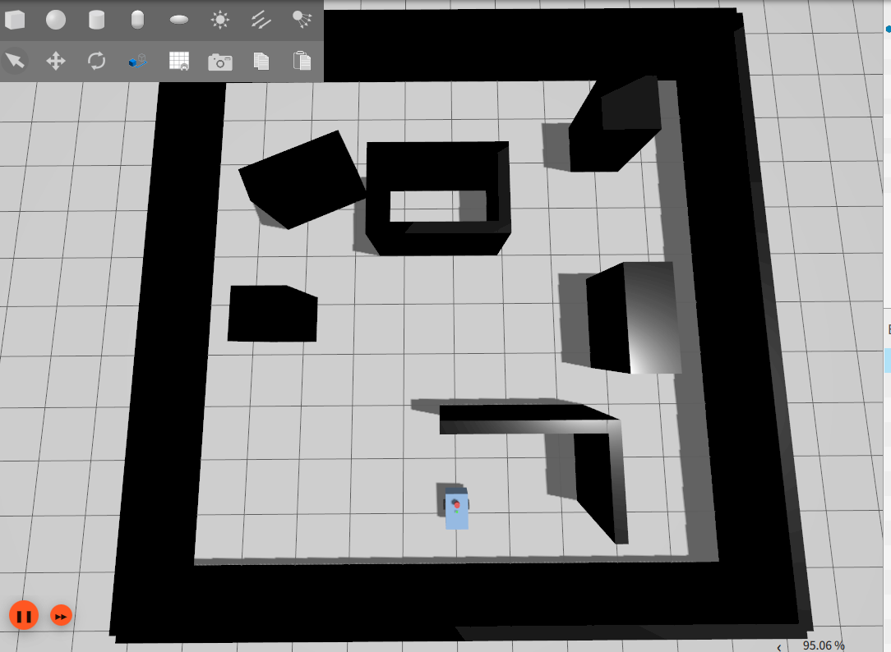
</td>
<td width="50%" align="center">
<b>SLAM Toolbox Mapping</b><br><br>
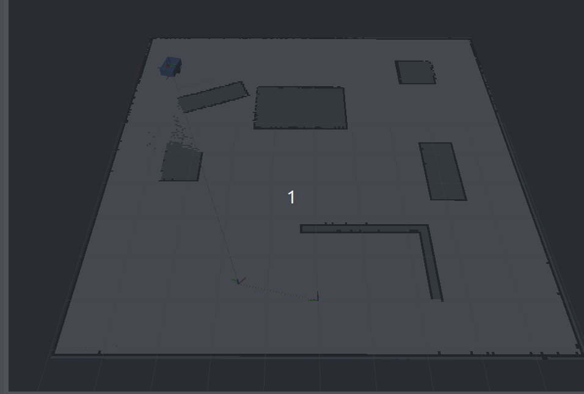
</td>
</tr>
<tr>
<td width="50%" align="center">
<b>Generated Occupancy Grid</b><br><br>
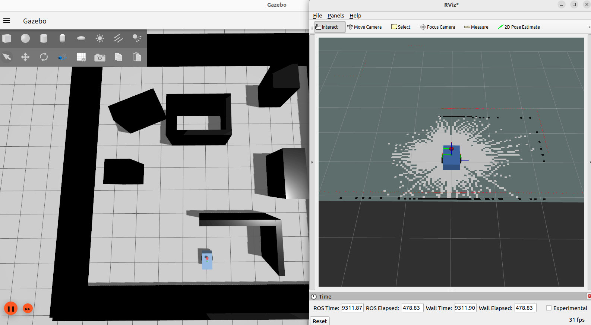
</td>
<td width="50%" align="center">
<b>Saved Map Reload Validation</b><br><br>
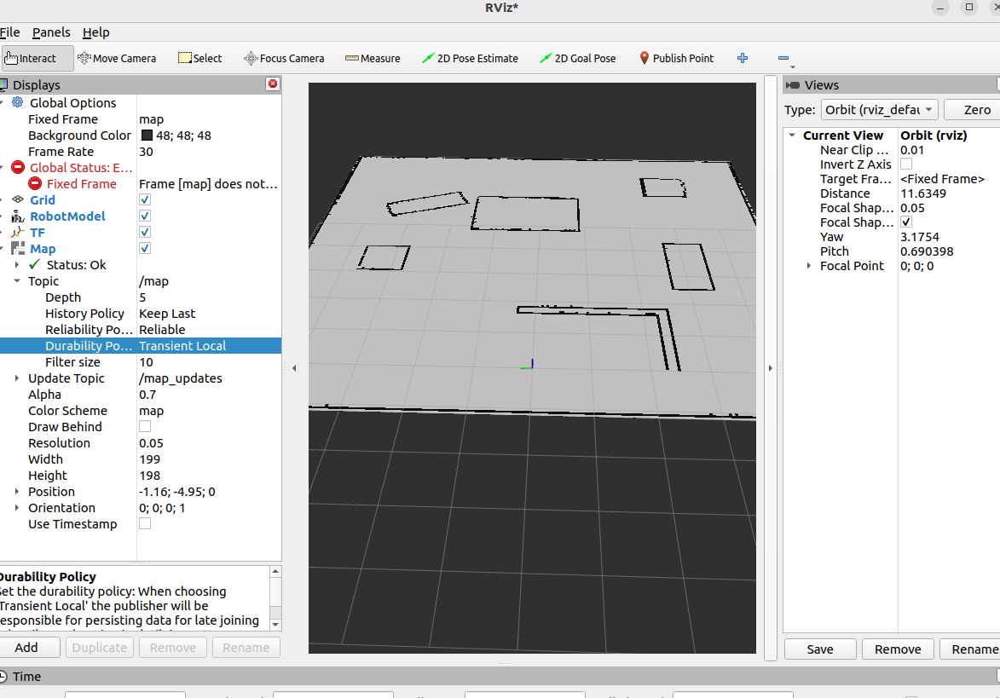
</td>
</tr>
</table>

The benchmark environment uses asymmetric wall and obstacle geometry to provide distinctive LiDAR features for scan-to-map matching.

### ICP Input Preparation & Frame Validation

<table>
<tr>
<td width="50%" align="center">
<b>LaserScan → PointCloud Validation</b><br><br>
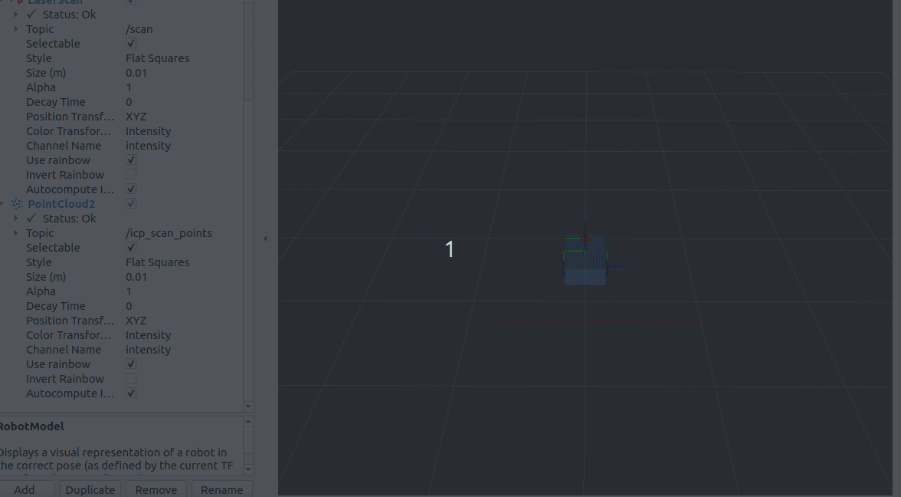
</td>
<td width="50%" align="center">
<b>OccupancyGrid → Reference PointCloud</b><br><br>
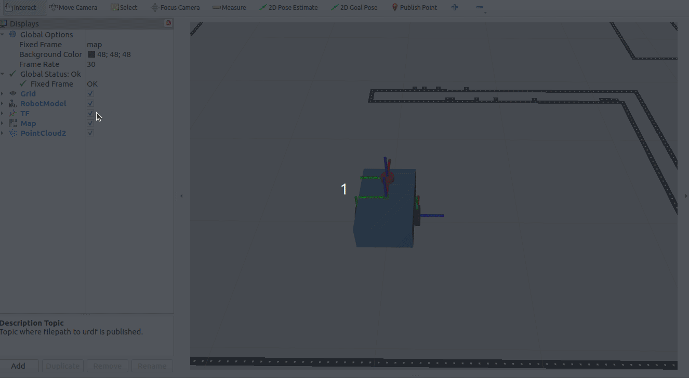
</td>
</tr>
<tr>
<td width="50%" align="center">
<b>LaserScan → Odom Frame</b><br><br>
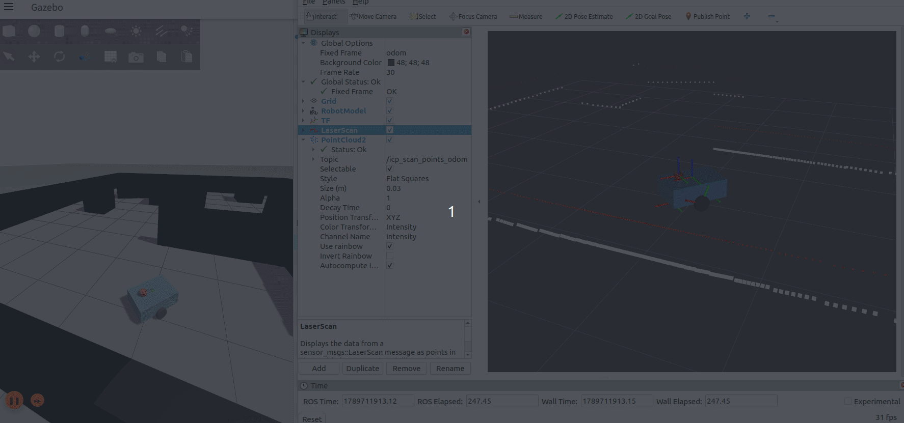
</td>
<td width="50%" align="center">
<b>Map-Frame ICP Source / Target Alignment</b><br><br>
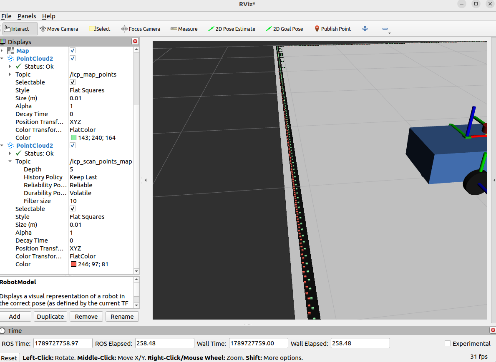
</td>
</tr>
</table>

These captures validate the ICP input pipeline before iterative correction:

```text
/scan
  ↓
2D scan points
  ↓
laser_link → odom
  ↓
odom → map
  ↓
Current scan [Source]
        +
Saved map points [Target]
```

### Nav2 + ICP Automated Benchmark

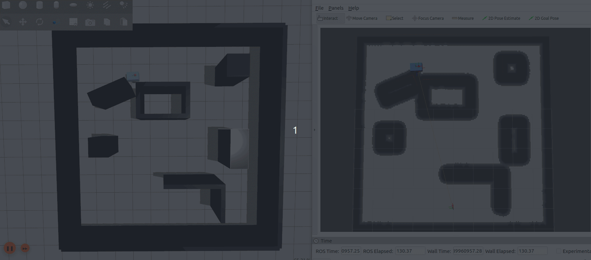

This GIF shows the integrated navigation benchmark in which Nav2 drives the AMR while the custom ICP localization stack provides the global `map -> odom` correction.


---

## Automated Benchmark

### Route

The same route is used for every run:

```text
START
  |
  v
P1  (3.39557, -4.12722, 0.0)
  |
  v
P2  (5.61326,  4.40286, 0.0)
  |
  v
P3  (7.68631, -1.58174, 0.0)
```

### Benchmark Inputs

```text
/ground_truth_pose
/odom
/icp_pose
/ekf_pose
```

### Logged Data

Each CSV contains:

```text
Ground Truth x / y / yaw
Wheel Odometry x / y / yaw
ICP x / y / yaw
EKF x / y / yaw

Odom position / yaw error
ICP position / yaw error
EKF position / yaw error

START / P1 / P2 / P3 events
continuous SAMPLE rows
```

### Startup Sequence

A staggered launch sequence is used to reduce lifecycle startup contention:

```text
0 s   Gazebo + ICP + Nav2
10 s  EKF
12 s  Ground Truth
15 s  Benchmark Runner
```

The benchmark runner additionally checks that `bt_navigator` is ACTIVE before sending the first goal.

---

## Performance Results

### Four-Run Quantitative Evaluation

| Method | Position RMSE | Yaw RMSE |
|---|---:|---:|
| Wheel Odometry | **0.0704 ± 0.0108 m** | **0.01106 ± 0.00196 rad** |
| Custom ICP | **0.04288 ± 0.00022 m** | **0.01279 ± 0.00016 rad** |
| Custom ICP + EKF | **0.04211 ± 0.00021 m** | **0.00510 ± 0.00010 rad** |

### Improvement Summary

| Comparison | Result |
|---|---:|
| Odom → ICP Position RMSE | **39.1% reduction** |
| Odom → ICP+EKF Position RMSE | **40.1% reduction** |
| ICP → ICP+EKF Position RMSE | **1.8% reduction** |
| ICP → ICP+EKF Yaw RMSE | **60.1% reduction** |

### Position RMSE

```text
Wheel Odometry
7.04 ± 1.08 cm

        ↓  ICP

Custom ICP
4.29 ± 0.02 cm

        ↓  EKF

ICP + EKF
4.21 ± 0.02 cm
```

The result indicates that **most of the position-drift correction comes from ICP**.

### Yaw RMSE

```text
Wheel Odometry
0.01106 rad

Custom ICP
0.01279 rad

        ↓ EKF Fusion

ICP + EKF
0.00510 rad
```

The strongest EKF improvement is observed in heading estimation.

---

## Result Figures

All figures below are loaded using repository-relative paths, so they are rendered directly on the GitHub README page.

### Trajectory and Overall Error


### Error Over Time

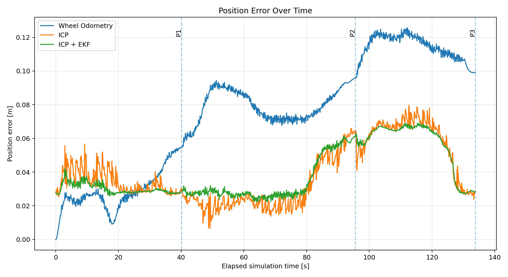

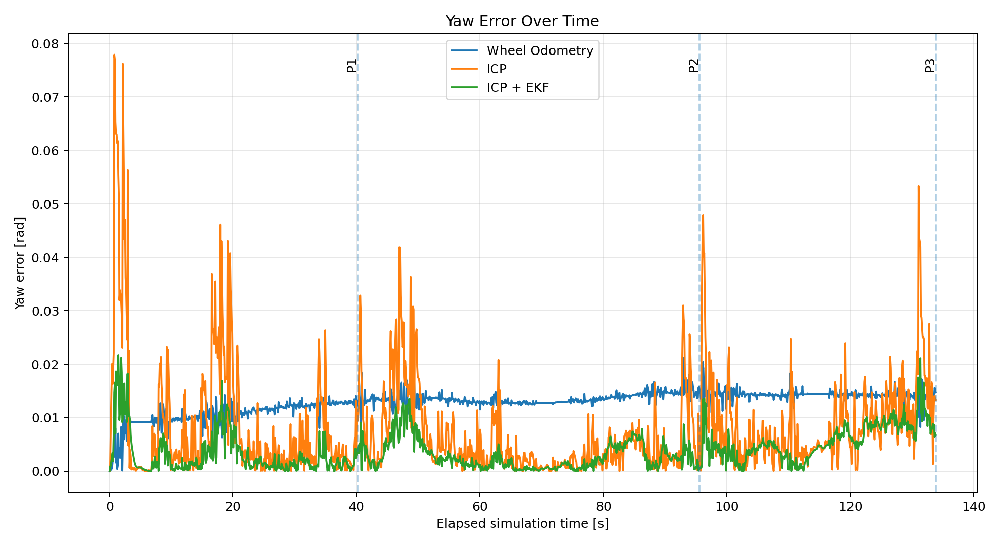

### Overall RMSE Comparison

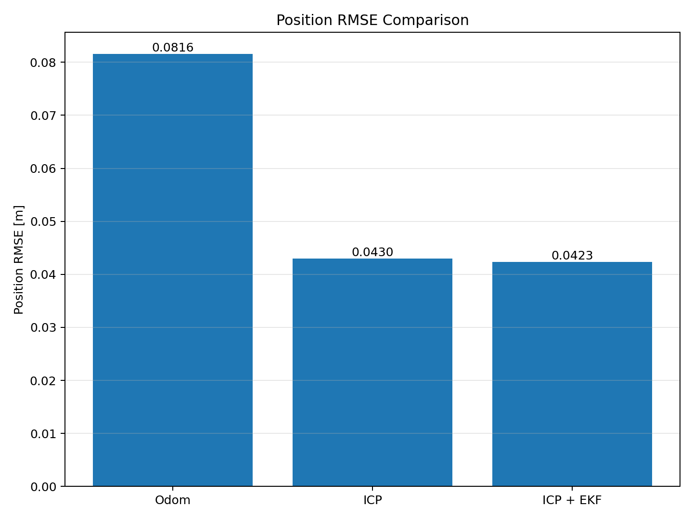

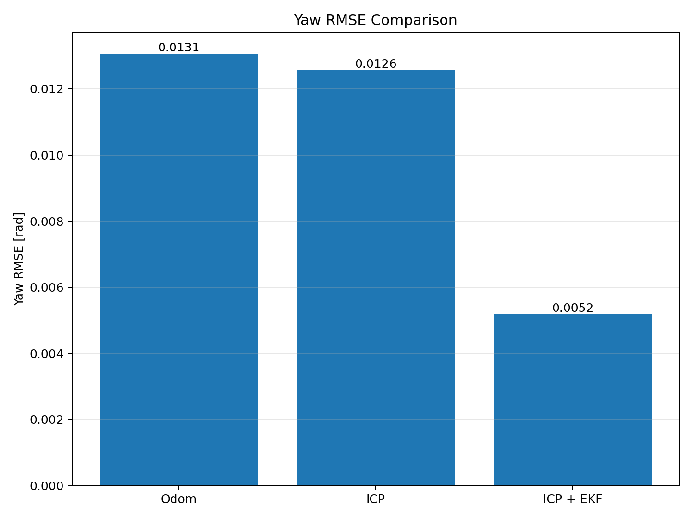

### Segment-Level RMSE

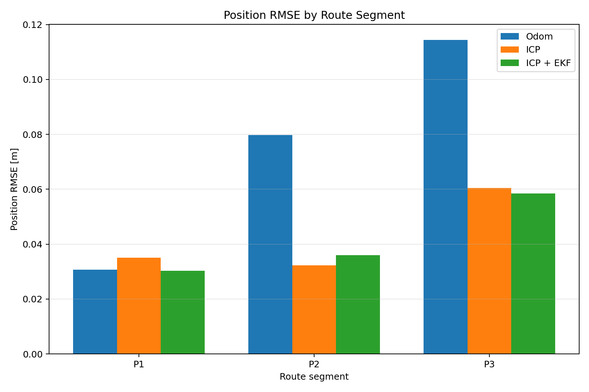

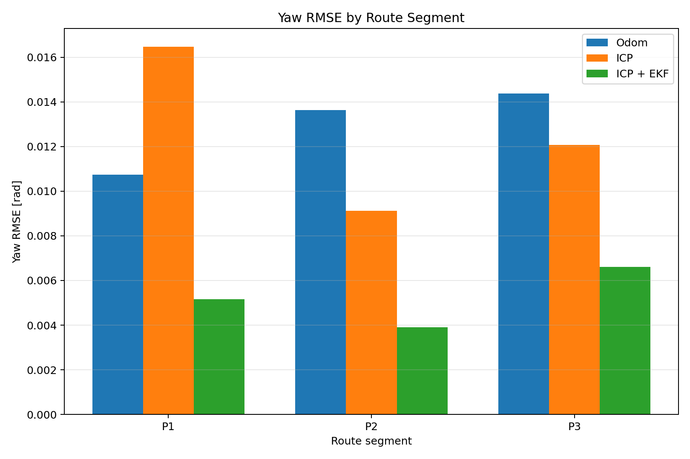

### Four-Run Mean ± Standard Deviation


---

## Key Findings & Design Decisions

### 1. ICP is the primary position-drift correction source

Wheel odometry showed increasing position error as the route progressed.

ICP reduced the four-run mean Position RMSE from:

```text
0.0704 m
   ↓
0.04288 m
```

The map therefore acts as the global reference that prevents unrestricted odometry drift.

---

### 2. EKF provides its clearest benefit in yaw stability

Adding EKF changed Position RMSE only slightly:

```text
ICP       0.04288 m
ICP+EKF   0.04211 m
```

but Yaw RMSE changed substantially:

```text
ICP       0.01279 rad
ICP+EKF   0.00510 rad
```

This indicates that the current fusion structure is more effective at stabilizing orientation than at producing a large additional x/y correction.

---

### 3. ICP does not always outperform odometry in yaw

The four-run mean ICP Yaw RMSE is slightly larger than the Wheel Odometry result.

Therefore:

```text
ICP ≠ automatically better in every state dimension
```

In the current implementation:

```text
ICP
→ strong position correction

EKF
→ yaw stabilization
```

This separation is reflected in the measured data.

---

### 4. TF hierarchy and algorithm order are different concepts

The TF tree is:

```text
map -> odom -> base_footprint
```

but the processing flow is:

```text
Robot moves
    ↓
Wheel odometry updates
    ↓
LiDAR scan arrives
    ↓
ICP aligns scan to map
    ↓
map -> odom correction updates
```

The TF hierarchy is a coordinate relationship, not the chronological execution order.

---

### 5. Timestamp-aligned TF lookup was required for moving ICP

Using only the latest TF can misplace a LiDAR scan when the robot is moving.

The ICP node therefore performs TF lookup using the LaserScan timestamp.

This was necessary to keep the scan placement and robot pose temporally consistent.

---

### 6. Nav2 startup required staged launch timing

Launching Gazebo, Nav2 lifecycle nodes, ICP, EKF, Ground Truth, and the benchmark runner at the same moment caused a lifecycle service timeout in `smoother_server`.

The final benchmark launch uses staged startup:

```text
Navigation → EKF → Ground Truth → Benchmark Runner
```

This allowed Nav2 to reach the ACTIVE state before automated waypoint execution.

---

## Troubleshooting Log — Selected

| Issue | Root Cause | Resolution |
|---|---|---|
| Positive `/cmd_vel` moved robot backward | Wheel joint axis direction was reversed | Changed wheel joint axis to `0 0 -1` |
| Wheels disappeared in RViz | Continuous wheel joint states were unavailable | Added Gazebo JointStatePublisher and bridged `/joint_states` |
| LaserScan dropped in RViz | Message Filter / queue behavior | Adjusted scan / TF validation configuration |
| Static `map -> odom` prevented real localization correction | Temporary validation TF remained active | Replaced with dynamic ICP TransformBroadcaster |
| Moving ICP needed better temporal consistency | Scan and TF used different effective times | Changed TF lookup to LaserScan timestamp |
| Nav2 benchmark did not start | Lifecycle startup contention / smoother service timeout | Staggered benchmark launch timing |
| Repetitive ICP/EKF logs obscured benchmark events | Per-update INFO logging | Commented repetitive INFO logs, retained WARN / ERROR |

---

## Evaluation Notes

### Ground Truth

Gazebo Ground Truth is used only as the evaluation reference.

```text
Ground Truth
      X
      |
      |  not used for estimator input
      |
ICP / EKF
```

### Repeatability

Four repeated runs were performed under the same route and simulation configuration.

Position RMSE standard deviation:

```text
Wheel Odometry : ± 0.0108 m
Custom ICP     : ± 0.00022 m
ICP + EKF      : ± 0.00021 m
```

Under this benchmark, the map-based localization outputs showed much lower run-to-run variation than odometry-only estimation.

---

## Limitations

- Final evaluation is simulation-based
- Benchmark samples are not offline-interpolated to one exact timestamp
- ICP and EKF are not fully statistically independent because both depend on odometry information
- EKF does not yet own the final `map -> odom` TF used by Nav2
- CPU utilization and processing-time statistics are not included
- AMCL / SLAM Toolbox localization are not included in the final four-run comparison
- ICP nearest-neighbor search currently uses brute-force search rather than a spatial index

---

## Build & Run

### Build Full Workspace

```bash
cd ~/ros2_icp_ekf_localization

colcon build --symlink-install

source install/setup.bash
```

### Build Localization / Evaluation Packages

```bash
colcon build \
  --symlink-install \
  --packages-select \
  icp_localization \
  ekf_localization \
  localization_evaluation \
  robot_simulation

source install/setup.bash
```

### Robot Model Validation

```bash
ros2 launch robot_description display.launch.py
```

### Gazebo Simulation

```bash
ros2 launch robot_simulation simulation.launch.py
```

### Custom ICP Localization

```bash
ros2 launch robot_simulation localization_icp.launch.py
```

### Nav2 with Custom ICP

```bash
ros2 launch robot_simulation navigation_icp.launch.py
```

### Automated Odom / ICP / EKF Benchmark

```bash
ros2 launch robot_simulation benchmark_icp.launch.py
```

---

## Repository Structure

```text
ros2_icp_ekf_localization/
├── src/
│   ├── robot_description/
│   │   ├── launch/
│   │   ├── meshes/
│   │   ├── rviz/
│   │   └── urdf/amr.urdf.xacro
│   │
│   ├── robot_simulation/
│   │   ├── config/
│   │   │   ├── bridge.yaml
│   │   │   ├── slam_toolbox.yaml
│   │   │   └── nav2_icp_params.yaml
│   │   ├── launch/
│   │   │   ├── simulation.launch.py
│   │   │   ├── localization_icp.launch.py
│   │   │   ├── navigation_icp.launch.py
│   │   │   └── benchmark_icp.launch.py
│   │   └── worlds/
│   │
│   ├── icp_localization/
│   │   └── src/icp_localization_node.cpp
│   │
│   ├── ekf_localization/
│   │   ├── config/
│   │   ├── launch/
│   │   └── src/ekf_localization_node.cpp
│   │
│   └── localization_evaluation/
│       └── src/
│           ├── ground_truth_node.cpp
│           ├── localization_evaluation_node.cpp
│           └── localization_benchmark_runner.cpp
│
├── maps/
│   ├── localization_map.pgm
│   └── localization_map.yaml
│
├── results/
│   ├── benchmark_01/
│   └── benchmark_02/
│
├── docs/
│   ├── COMMANDS.md
│   ├── TIMELINE.md
│   └── images/
│
├── README.md
└── .gitignore
```

---

## Final KPI Summary

| KPI | Result |
|---|---:|
| Repeated benchmark runs | **4** |
| Wheel Odometry Position RMSE | **0.0704 ± 0.0108 m** |
| ICP Position RMSE | **0.04288 ± 0.00022 m** |
| ICP + EKF Position RMSE | **0.04211 ± 0.00021 m** |
| Odom → ICP Position improvement | **39.1%** |
| Odom → ICP+EKF Position improvement | **40.1%** |
| ICP Yaw RMSE | **0.01279 ± 0.00016 rad** |
| ICP + EKF Yaw RMSE | **0.00510 ± 0.00010 rad** |
| ICP → EKF Yaw improvement | **60.1%** |

---

## Tech Stack

**Framework:** ROS2 Humble  
**Language:** C++17  
**Simulation:** Gazebo Fortress  
**Visualization:** RViz2  
**Navigation:** Nav2  
**Localization:** Custom 2D ICP  
**Sensor Fusion:** Custom EKF  
**Sensors:** 2D LiDAR, Wheel Odometry, IMU  
**Bridge:** ros_gz_bridge  
**Build:** colcon / CMake  

---

## Conclusion

The completed system demonstrates an end-to-end localization development workflow:

```text
AMR Model
   ↓
Gazebo Simulation
   ↓
Sensor Integration
   ↓
Saved Map
   ↓
Custom ICP
   ↓
Custom EKF
   ↓
Nav2 Integration
   ↓
Ground Truth Benchmark
   ↓
Four-Run Quantitative Evaluation
```

Measured results show that:

- **ICP is effective at suppressing accumulated wheel-odometry position drift**
- **Most position improvement is achieved before EKF fusion**
- **EKF provides the strongest improvement in yaw / heading stability**
- **ICP and ICP+EKF results are repeatable under the same simulation benchmark**

The current implementation is complete for the intended portfolio scope.

---

## Future Work

- Make EKF the sole `map -> odom` publisher
- Use fused EKF pose directly for Nav2 localization
- Add Mahalanobis gating for ICP measurement rejection
- Add strict timestamp-aligned rosbag evaluation
- Measure ICP / EKF mean and P95 processing time
- Compare against AMCL / SLAM Toolbox localization
- Replace brute-force nearest-neighbor search with a KD-tree or equivalent spatial index
- Validate the same pipeline on physical hardware

---


## Result Directory

```text
results/benchmark_02/
├── 4run_mean_position_rmse.png
├── 4run_mean_yaw_rmse.png
├── error_analysis.png
├── localization_benchmark_1.csv
├── localization_benchmark_2.csv
├── localization_benchmark_3.csv
├── localization_benchmark_4.csv
├── position_error_time.png
├── position_rmse_comparison.png
├── segment_position_rmse.png
├── segment_yaw_rmse.png
├── trajectory_comparison.png
├── yaw_error_time.png
└── yaw_rmse_comparison.png
```

## Documentation

The previous development-oriented README can be preserved as:

```text
docs/README_DEVELOPMENT.md
```

Detailed command history:

```text
docs/COMMANDS.md
```

Chronological development history:

```text
docs/TIMELINE.md
```
