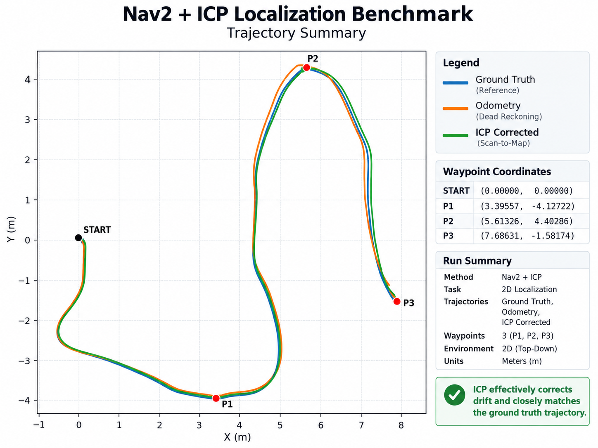
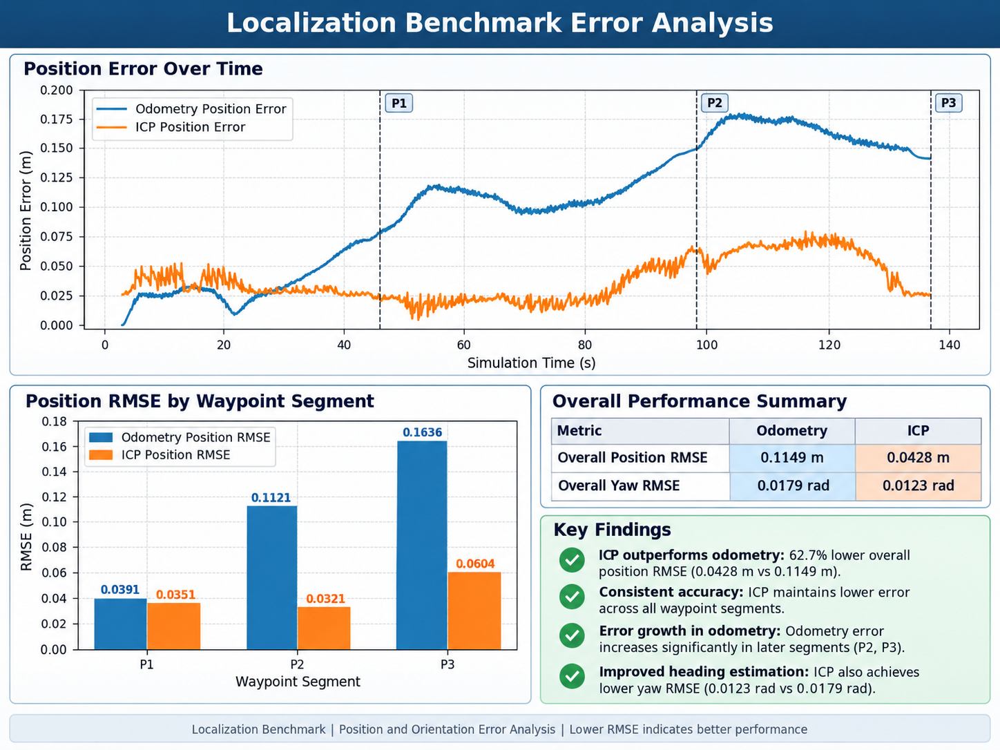

# ROS2 ICP + EKF Localization for AMR

A ROS2-based localization project implementing **2D LiDAR ICP localization and EKF sensor fusion** for an Autonomous Mobile Robot (AMR).

The objective of this project is to build the localization pipeline from the ground up using **C++ and ROS2**, rather than relying only on existing localization packages.

## 1. Project Overview

This project develops an AMR localization system using:

- 2D LiDAR
- Wheel Odometry
- IMU
- ICP Scan Matching
- Extended Kalman Filter (EKF)

The implemented localization pipeline estimates the robot pose:

```text
[x, y, yaw]
```

by combining LiDAR-based scan-to-map localization with wheel odometry and IMU measurements.

The complete benchmark is executed in Gazebo Fortress and evaluated against simulation ground truth using the same automated START -> P1 -> P2 -> P3 route over four repeated runs.

---

## 2. Development Environment

| Component | Version |
|---|---|
| OS | Ubuntu 22.04 LTS |
| ROS | ROS2 Humble |
| Language | C++ |
| Simulation | Gazebo Fortress |
| Visualization | RViz2 |
| Build System | colcon / CMake |
| Robot Model | URDF / Xacro |

---

## 3. System Architecture

```text
                         Saved Occupancy Map
                                  |
                                  v
2D LiDAR /scan ------------> Custom ICP
                                  |
                                  +---- dynamic map -> odom TF
                                  |
                                  +---- /icp_pose
                                          |
                                          v
Wheel Odometry /odom -------> EKF Prediction / Update
IMU /imu -------------------->        |
                                          v
                                      /ekf_pose
                                      /ekf_odom
```

The current validated benchmark architecture uses the custom ICP node as the `map -> odom` TF authority so that Nav2 can navigate with the custom localization correction, while the EKF runs in parallel and publishes the fused pose for quantitative comparison.

```text
map
 |
 |  Custom ICP correction
 v
odom
 |
 |  Wheel odometry
 v
base_footprint
 |
 +---- base_link
       |
       +---- laser_link
       |
       +---- imu_link
       |
       +---- left_wheel_link
       |
       +---- right_wheel_link
```

For evaluation:

```text
Gazebo Ground Truth
        |
        +-------------------+
        |                   |
        v                   v
      /odom              /icp_pose
        |                   |
        +---------+---------+
                  |
               /ekf_pose
                  |
                  v
      localization_benchmark_runner
                  |
                  +---- continuous SAMPLE rows
                  +---- START / P1 / P2 / P3 event rows
                  +---- Position / Yaw error
                  +---- CSV output
```

---

## 4. Robot Model

A differential-drive AMR model was created using URDF/Xacro.

The robot currently consists of:

- `base_footprint`
- `base_link`
- `left_wheel_link`
- `right_wheel_link`
- `front_caster_link`
- `rear_caster_link`
- `laser_link`
- `imu_link`

### Robot Dimensions

| Parameter | Value |
|---|---:|
| Body Length | 0.60 m |
| Body Width | 0.40 m |
| Body Height | 0.20 m |
| Drive Wheel Radius | 0.08 m |
| Drive Wheel Width | 0.04 m |
| Caster Radius | 0.04 m |

Two passive spherical caster contacts are used to stabilize the differential-drive robot in simulation.

The drive wheels use relatively high friction for traction, while the passive caster contacts use low friction to reduce resistance during rotation.

---

## 5. Current Project Structure

```text
ros2_icp_ekf_localization/
│
├── src/
│   ├── robot_description/
│   │   ├── launch/
│   │   │   └── display.launch.py
│   │   ├── meshes/
│   │   ├── rviz/
│   │   └── urdf/
│   │       └── amr.urdf.xacro
│   │
│   ├── robot_simulation/
│   │   ├── config/
│   │   │   ├── bridge.yaml
│   │   │   ├── slam_toolbox.yaml
│   │   │   └── nav2_icp_params.yaml
│   │   ├── launch/
│   │   │   ├── simulation.launch.py
│   │   │   ├── localization_icp.launch.py
│   │   │   ├── navigation_icp.launch.py
│   │   │   └── benchmark_icp.launch.py
│   │   └── worlds/
│   │       ├── empty_world.sdf
│   │       └── localization_world.sdf
│   │
│   ├── icp_localization/
│   │   ├── CMakeLists.txt
│   │   ├── package.xml
│   │   └── src/
│   │       └── icp_localization_node.cpp
│   │
│   ├── ekf_localization/
│   │   ├── CMakeLists.txt
│   │   ├── package.xml
│   │   ├── config/
│   │   ├── launch/
│   │   │   └── ekf_localization.launch.py
│   │   └── src/
│   │       └── ekf_localization_node.cpp
│   │
│   └── localization_evaluation/
│       ├── CMakeLists.txt
│       ├── package.xml
│       └── src/
│           ├── ground_truth_node.cpp
│           ├── localization_evaluation_node.cpp
│           └── localization_benchmark_runner.cpp
│
├── maps/
│   ├── localization_map.pgm
│   └── localization_map.yaml
│
├── results/
│   ├── benchmark_01/
│   │   ├── README.md
│   │   ├── localization_benchmark.csv
│   │   ├── trajectory_comparison.png
│   │   └── error_analysis.png
│   │
│   └── benchmark_02/
│       ├── localization_benchmark_1.csv
│       ├── localization_benchmark_2.csv
│       ├── localization_benchmark_3.csv
│       ├── localization_benchmark_4.csv
│       ├── trajectory_comparison.png
│       ├── error_analysis.png
│       ├── position_error_time.png
│       ├── yaw_error_time.png
│       ├── position_rmse_comparison.png
│       ├── yaw_rmse_comparison.png
│       ├── segment_position_rmse.png
│       ├── segment_yaw_rmse.png
│       ├── 4run_mean_position_rmse.png
│       └── 4run_mean_yaw_rmse.png
│
├── docs/
│   ├── COMMANDS.md
│   ├── TIMELINE.md
│   └── images/
│
├── README.md
└── .gitignore
```

---

# 6. Development Timeline

## Phase 1 — Development Environment

**Status: Completed**

- Installed Ubuntu 22.04
- Installed ROS2 Humble
- Configured ROS2 workspace
- Configured colcon build environment
- Installed RViz2
- Installed Gazebo Fortress / ROS-Gazebo integration

---

## Phase 2 — AMR URDF/Xacro Model

**Status: Completed**

Created a differential-drive AMR using Xacro.

Implemented:

- `base_footprint`
- `base_link`
- Left drive wheel
- Right drive wheel
- LiDAR frame
- IMU frame
- Front passive caster
- Rear passive caster

Defined:

- Visual geometry
- Collision geometry
- Mass
- Inertia
- Joint relationships
- Sensor mounting positions

---

## Phase 3 — TF and Robot Model Validation

**Status: Completed**

Validated the robot model using:

```bash
xacro
check_urdf
robot_state_publisher
joint_state_publisher
RViz2
```

Verified TF hierarchy and robot geometry in RViz2.

Example:

```text
base_footprint
      |
      v
   base_link
      |
      +---- left_wheel_link
      |
      +---- right_wheel_link
      |
      +---- laser_link
      |
      +---- imu_link
      |
      +---- front_caster_link
      |
      +---- rear_caster_link
```

### RViz2 Robot Model Validation


---

## Phase 4 — Gazebo Simulation Environment

**Status: Completed**

Created the first Gazebo world:

```text
empty_world.sdf
```

Current simulation contains:

- Ground plane
- Directional light
- Physics system
- AMR model

The URDF/Xacro robot has successfully been spawned into Gazebo.

Passive caster contacts were added because the original two-wheel model could rotate around the drive-wheel axis under gravity.

### Current Milestone

```text
URDF/Xacro
    ↓
robot_state_publisher
    ↓
Gazebo Fortress
    ↓
Robot Spawn
    ↓
Stable Ground Contact
```

---

## Phase 5 — Differential Drive

**Status: Completed**

Implemented:

- Gazebo Fortress Differential Drive system
- `left_wheel_joint` / `right_wheel_joint` connection
- Wheel separation: `0.44 m`
- Wheel radius: `0.08 m`
- `/cmd_vel` velocity command
- Wheel odometry generation

Verified motion:

- `linear.x > 0` → Forward (+X / LiDAR direction)
- `linear.x < 0` → Backward
- `angular.z > 0` → Counter-clockwise rotation
- `angular.z < 0` → Clockwise rotation

During the initial motion test, positive `linear.x` moved the robot backward and positive `angular.z` rotated the robot clockwise.

The issue was caused by the wheel joint axis direction.

Changed both wheel joint axes from:

```xml
<axis xyz="0 0 1"/>
```

to:

```xml
<axis xyz="0 0 -1"/>
```

After rebuilding and restarting Gazebo, forward/backward motion and left/right rotation were verified successfully.

### Differential Drive Validation

Forward motion:


Rotation test:


Current Gazebo topics:

```text
/cmd_vel
/model/icp_ekf_amr/odometry
/model/icp_ekf_amr/tf
```

Next objective:

```text
ROS2 /cmd_vel
      |
      v
ros_gz_bridge
      |
      v
Gazebo Differential Drive
      |
      v
ROS2 /odom
```

---

## Phase 5-1 — ROS2 ↔ Gazebo Bridge

**Status: Completed**

Integrated `ros_gz_bridge` into `simulation.launch.py` so that the ROS2 and Gazebo communication bridge starts automatically with the simulation.

Implemented:

- ROS2 `/cmd_vel` → Gazebo Differential Drive
- Gazebo odometry → ROS2 `/odom`
- Automatic bridge startup from `simulation.launch.py`
- Verified ROS2 velocity command without using `ign topic`
- Verified ROS2 odometry output

Target communication flow:

```text
ROS2 /cmd_vel
      |
      v
ros_gz_bridge
      |
      v
Gazebo Differential Drive
      |
      v
AMR Motion
      |
      v
Gazebo Odometry
      |
      v
ros_gz_bridge
      |
      v
ROS2 /odom
```

Validation:

```text
ros2 launch robot_simulation simulation.launch.py
        ↓
parameter_bridge automatically started
        ↓
ROS2 /cmd_vel available
        ↓
AMR moves correctly
        ↓
ROS2 /odom available
        ↓
Odometry values change during motion
```

With this step complete, the Differential Drive simulation can now be controlled entirely through ROS2 topics.

### ROS2 Bridge Validation


---

## Phase 5-2 — Gazebo Joint State Integration

**Status: Completed**

Integrated Gazebo wheel joint states with ROS2 so that the continuous drive-wheel joints can be represented correctly in the ROS2 TF tree and RViz2.

Implemented:

- Gazebo `JointStatePublisher` for `left_wheel_joint` and `right_wheel_joint`
- Gazebo joint state → ROS2 `/joint_states` bridge
- `robot_state_publisher` integration using wheel joint states
- Dynamic TF generation for `left_wheel_link` and `right_wheel_link`
- RViz2 wheel visualization without relying on a standalone `joint_state_publisher` for simulation state

Data flow:

```text
Gazebo Wheel Joints
      |
      v
Gazebo JointStatePublisher
      |
      v
ros_gz_bridge
      |
      v
ROS2 /joint_states
      |
      v
robot_state_publisher
      |
      v
/tf
      |
      v
RViz2
```

This resolved the issue where fixed links were visible in RViz2 but the continuous left/right wheel links were missing because wheel joint states were unavailable to `robot_state_publisher`.

---

## Phase 6 — LiDAR Simulation

**Status: Completed**

Integrated a simulated 360° 2D GPU LiDAR sensor and connected the Gazebo LaserScan output to ROS2.

Configuration:

- Horizontal field of view: `360°`
- Samples: `360`
- Minimum range: `0.10 m`
- Maximum range: `10.0 m`
- Update rate: `10 Hz`
- ROS2 output: `/scan`

Implemented:

- Gazebo GPU LiDAR sensor on `laser_link`
- Gazebo Sensors system using Ogre2
- Gazebo `/scan` → ROS2 `/scan` bridge
- LiDAR sensor frame alignment with the ROS2 TF tree
- RViz2 LaserScan visualization
- Static obstacle detection test in Gazebo

Data flow:

```text
Gazebo GPU LiDAR
      |
      v
Gazebo /scan
      |
      v
ros_gz_bridge
      |
      v
ROS2 /scan
      |
      v
RViz2 LaserScan
```

During initial RViz2 validation, LaserScan messages were dropped because the Gazebo LiDAR frame did not match an available ROS2 TF frame. Aligning the sensor frame with `laser_link` resolved the RViz Message Filter queue overflow.

Final validation confirmed that static obstacles in the Gazebo world are detected and displayed as LaserScan points in RViz2.

### Joint State and LiDAR Visualization


---

## Phase 7 — IMU Simulation

**Status: Completed**

Integrated a simulated IMU sensor into the AMR model and bridged the Gazebo IMU output to ROS2.

Configuration:

- Sensor link: `imu_link`
- ROS2 output: `/imu`
- Message type: `sensor_msgs/msg/Imu`
- Update rate: `50 Hz`
- Sensor frame: `imu_link`

Implemented:

- Gazebo IMU system plugin
- IMU sensor attached to `imu_link`
- Gazebo `/imu` → ROS2 `/imu` bridge
- IMU frame alignment with the ROS2 TF tree
- Orientation, angular velocity, and linear acceleration validation
- Robot rotation test using `angular_velocity.z`

Data flow:

```text
Gazebo IMU
      |
      v
Gazebo /imu
      |
      v
ros_gz_bridge
      |
      v
ROS2 /imu
      |
      v
Localization Pipeline
```

During initial validation, the IMU message used a Gazebo-scoped sensor frame instead of `imu_link`. The sensor frame was aligned with the ROS2 TF tree so that `/imu` can be used consistently in the later EKF stage.

---

## Phase 8 — Evaluation Environment and Mapping

**Status: Completed**

Created a fixed benchmark environment for mapping and future localization evaluation.

The evaluation world is stored as:

```text
src/robot_simulation/worlds/localization_world.sdf
```

The environment intentionally contains asymmetric geometric features, including:

- Outer walls
- Different-sized box landmarks
- A rotated rectangular obstacle
- A central rectangular structure
- An L-shaped wall feature

The asymmetric layout reduces geometric ambiguity and provides distinct LiDAR features for scan matching and localization evaluation.

### Benchmark World Validation


### World and Initial Pose Selection

`simulation.launch.py` was extended with launch arguments so that the simulation world and robot initial pose can be selected without modifying the launch file.

Example:

```bash
ros2 launch robot_simulation simulation.launch.py \
world:=localization_world.sdf \
x:=0.0 \
y:=-3.8 \
yaw:=1.5708
```

This allows the benchmark environment and initial pose to remain fixed across future localization experiments.

### Odometry TF Integration

The Gazebo Differential Drive configuration was extended to publish the odometry TF relationship:

```text
odom
  |
  v
base_footprint
  |
  v
base_link
```

The Gazebo TF output is bridged to ROS2 `/tf`, allowing SLAM Toolbox and future localization nodes to use the same TF chain.

### SLAM Toolbox Mapping

SLAM Toolbox was configured using:

```text
scan_topic: /scan
odom_frame: odom
map_frame: map
base_frame: base_footprint
mode: mapping
```

The LiDAR range configuration was matched to the simulated sensor:

```text
Minimum range: 0.10 m
Maximum range: 10.0 m
```

Mapping pipeline:

```text
Gazebo localization_world
      |
      v
2D LiDAR /scan
      |
      +------------------+
      |                  |
      v                  v
LaserScan        odom -> base_footprint
      |                  |
      +--------+---------+
               |
               v
         SLAM Toolbox
               |
         +-----+-----+
         |           |
         v           v
       /map      map -> odom
```

A 2D Occupancy Grid was successfully generated in RViz2.

### SLAM Toolbox Mapping Validation


Final generated Occupancy Grid:


Current generated map information:

- Resolution: `0.05 m/cell`
- Width: `199 cells`
- Height: `198 cells`
- ROS2 type: `nav_msgs/msg/OccupancyGrid`

The generated map was saved as:

```text
maps/
├── localization_map.pgm
└── localization_map.yaml
```

### Saved Map Reload Validation

The saved map was reloaded using Nav2 Map Server and validated in RViz2.

The `/map` topic uses a durable map-style QoS profile. During validation, explicitly matching the subscriber QoS was required:

```text
Reliability: Reliable
Durability: Transient Local
```

The saved Occupancy Grid was successfully received and displayed in RViz2 with `Map -> Status: Ok`.


When only Map Server is running, `map -> odom` is not published. Therefore, RViz2 may report that the `map` Fixed Frame does not exist in the TF tree even though the saved Occupancy Grid itself is loaded correctly. A localization node will provide the required map-relative transform in later stages.

---

## Phase 9 — ICP Localization

**Status: Completed for the current ICP baseline benchmark**

The custom 2D ICP localization package is implemented in C++ using the saved Occupancy Grid, current 2D LiDAR scan, odometry-frame TF, and an internally maintained `map -> odom` estimate.

Current processing pipeline:

```text
Saved Map /map
      |
      v
OccupancyGrid -> Occupied Cells
      |
      v
map_points_  [Target / map frame]
      |
      +-----------------------------------------------------------+
                                                                  |
Current LiDAR /scan                                               |
      |                                                           |
      v                                                           |
LaserScan -> 2D Points [laser_link]                               |
      |                                                           |
      v                                                           |
Timestamp-aligned TF: laser_link -> odom                          |
      |                                                           |
      v                                                           |
odom_points                                                       |
      |                                                           |
      v                                                           |
Current T_map_odom                                                |
      |                                                           |
      v                                                           |
map_scan_points [Source / map frame] -----------------------------+
                                                                  |
                                                                  v
                                                Nearest Neighbor Search
                                                                  |
                                                                  v
                                                     Correspondence Pairs
                                                                  |
                                                                  v
                                                        Outlier Rejection
                                                                  |
                                                                  v
                                                 Source / Target Centroids
                                                                  |
                                                                  v
                                             2D Rigid Correction Estimation
                                                delta_x / delta_y / delta_yaw
                                                                  |
                                                                  v
                                                   T_map_odom Update
                                                                  |
                                                                  v
                                              Repeat Until Convergence
```

### ICP ROS2 Package

Created the C++ package:

```text
src/icp_localization/
├── CMakeLists.txt
├── package.xml
└── src/
    └── icp_localization_node.cpp
```

Current dependencies:

- `rclcpp`
- `sensor_msgs`
- `nav_msgs`
- `tf2`
- `tf2_ros`
- `tf2_geometry_msgs`

### LaserScan to 2D Point Cloud

Implemented:

- ROS2 `/scan` subscription
- Invalid range filtering using finite values and sensor range limits
- LiDAR beam-angle calculation using `angle_min` and `angle_increment`
- Polar-to-Cartesian conversion
- Internal `Point2D` representation
- ROS2 `sensor_msgs/msg/PointCloud2` publication on `/icp_scan_points`

Coordinate conversion:

```text
angle = angle_min + i * angle_increment
x = range * cos(angle)
y = range * sin(angle)
```

The original `/scan` visualization and the converted `/icp_scan_points` were displayed simultaneously in RViz2. The point sets overlapped correctly, validating the scan conversion used as the first ICP input-preparation step.


### OccupancyGrid to Reference Point Cloud

Implemented:

- ROS2 `/map` subscription
- Occupied-cell extraction from `nav_msgs/msg/OccupancyGrid`
- 1D map index conversion to row and column
- Grid-cell center conversion to map-frame metric coordinates
- Persistent `map_points_` class member so the reference points remain available after `mapCallback()` returns
- ROS2 `sensor_msgs/msg/PointCloud2` publication on `/icp_map_points`

Grid conversion:

```text
column = index % width
row    = index / width

x = origin_x + (column + 0.5) * resolution
y = origin_y + (row + 0.5) * resolution
```

Occupied cells currently use an occupancy threshold of `65` or greater. The generated reference points follow the walls and obstacles of the saved Occupancy Grid in RViz2.


### LaserScan to Odom Frame Transformation

The current LiDAR points are transformed from `laser_link` into the odometry coordinate frame using the ROS2 TF tree.

```text
laser_link points
      |
      v
TF lookup: odom <- laser_link
      |
      v
2D rotation + translation
      |
      v
odom_points
```

The transform translation and yaw are applied manually using:

```text
x' = cos(yaw) * x - sin(yaw) * y + tx
y' = sin(yaw) * x + cos(yaw) * y + ty
```

The transformed points are published on:

```text
Topic: /icp_scan_points_odom
Frame: odom
```

Dynamic RViz2 validation confirmed that the transformed scan follows the robot motion in the odometry frame.


### Odom to Map Frame Transformation

For ICP comparison, both the current scan and saved-map reference points use the `map` coordinate frame.

A `Pose2D` structure stores the current internal `map -> odom` estimate:

```text
[x, y, yaw]
```

The benchmark starts from an identity initial estimate:

```text
x   = 0.0
y   = 0.0
yaw = 0.0
```

The odometry-frame scan points are transformed using this estimate and published as:

```text
Topic: /icp_scan_points_map
Frame: map
```

This topic does **not** create a new map. It represents the current LiDAR observation expressed in the saved map coordinate frame.

### Nearest-Neighbor Correspondence Search

Each current Source scan point is matched with the closest Target map point.

The first implementation intentionally uses brute-force search:

```text
For each Source scan point
      |
      v
Compare against every Target map point
      |
      v
Select minimum squared Euclidean distance
      |
      v
Create Source <-> Target correspondence
```

Squared distance is used during nearest-neighbor comparison:

```text
distance^2 = dx^2 + dy^2
```

This avoids an unnecessary square root for every map-point comparison.

The brute-force implementation is retained at this stage because it makes the ICP matching process explicit and easy to validate. A KD-tree can be introduced later for performance optimization.

### Correspondence Filtering / Outlier Rejection

A nearest map point is not automatically a trustworthy correspondence. Distant pairs can be caused by measurement noise, dynamic objects, map mismatch, incorrect nearest-neighbor association, or initial pose error.

A maximum correspondence-distance threshold is therefore applied before rigid-transform estimation.

The normal development value is currently:

```text
Maximum correspondence distance: 0.15 m
```

For validation, the threshold was temporarily reduced to `0.05 m`. During this test, the system correctly rejected distant correspondences while preserving the identity:

```text
Raw = Valid + Rejected
```

Observed validation examples included:

```text
Raw: 360 | Valid: 358 | Rejected: 2
Raw: 360 | Valid: 355 | Rejected: 5
Raw: 360 | Valid: 351 | Rejected: 9
```

The threshold was then restored to `0.15 m` so that the initial ICP alignment has more tolerance before convergence.

### Centroid and 2D Rigid Correction

Only valid correspondences are used to estimate the rigid correction.

The Source and Target centroids are calculated first:

```text
source_centroid = mean(Source points)
target_centroid = mean(Target points)
```

Subtracting each centroid places both point sets around a common origin so that the rotation component can be estimated independently of the overall translation.

The 2D incremental rotation is calculated from the centered correspondence pairs, and translation is then recovered from:

```text
t = target_centroid - R * source_centroid
```

The resulting incremental correction is:

```text
delta_x
delta_y
delta_yaw
```

The correction is composed with the previous pose estimate as:

```text
T_new = Delta_T * T_old
```

rather than simply adding translation values without accounting for rotation.

### ICP Iteration and Convergence

The ICP solver now repeats correspondence search and rigid correction multiple times for the **same LaserScan frame**.

```text
One LaserScan
      |
      v
Correspondence Search
      |
      v
Outlier Rejection
      |
      v
Rigid Correction
      |
      v
Update Temporary Pose
      |
      +----> Repeat
```

Current convergence settings:

```text
Maximum iterations: 10
Translation convergence threshold: 0.001 m
Rotation convergence threshold: 0.001 rad
```

The iteration stops early when both the translation correction magnitude and rotation correction are sufficiently small.

Stationary validation confirmed convergence. After the initial correction, subsequent scans converged at the first iteration with correction values effectively equal to zero.

Example observed result:

```text
ICP Iteration | iter: 1/10 | converged: true
Raw: 360 | Valid: 360 | Rejected: 0
Raw mean: 0.01372 m
mean: 0.01372 -> 0.01372 m

Final Correction
dx: 0.000000 m
dy: 0.000000 m
dyaw: 0.000000 rad
map_to_odom: (0.01555, 0.02279, -0.00001)
```

An earlier correction also reduced the correspondence mean distance from approximately `0.02343 m` to `0.01751 m`, confirming that the rigid correction moved the Source point set toward the Target point set before convergence.

### LaserScan Timestamp-Aligned TF

The previous implementation used:

```text
tf2::TimePointZero
```

which requested the latest available TF.

This can introduce a temporal mismatch while the robot is moving because the LiDAR measurement timestamp and latest TF timestamp may differ.

The TF lookup now uses the actual LaserScan timestamp:

```text
scan_time = msg->header.stamp
lookupTransform(
    target = odom,
    source = laser frame,
    time   = scan_time
)
```

A `0.1 s` lookup timeout is used.

This change ensures that a LaserScan is transformed using the robot pose corresponding to the scan measurement time rather than an unrelated latest transform.

### Simulation Clock Bridge

The localization nodes use:

```text
use_sim_time = true
```

During integration testing, `/clock` existed in the ROS2 graph but initially had:

```text
Publisher count: 0
```

As a result, ROS simulation time did not advance and time-dependent throttled logs / timestamp processing did not behave as expected.

Gazebo simulation time was added to the existing ROS-Gazebo bridge configuration:

```text
Gazebo /clock
      |
      v
ros_gz_bridge
      |
      v
ROS2 /clock
```

The `/clock` bridge is managed together with the other bridge topics in:

```text
src/robot_simulation/config/bridge.yaml
```

This allows the Map Server and ICP node to keep `use_sim_time=true` without requiring a separate Clock bridge terminal.

### Integrated ICP Localization Launch

A dedicated launch file was added:

```text
src/robot_simulation/launch/localization_icp.launch.py
```

It starts the current localization test environment from a single command:

```text
Gazebo benchmark simulation
robot_state_publisher
robot spawn
ROS-Gazebo bridge
Nav2 Map Server
Map Server lifecycle configure / activate
icp_localization_node
      |
      v
dynamic map -> odom TF
```

Run:

```bash
ros2 launch robot_simulation localization_icp.launch.py
```

The dedicated launch keeps the current ICP development environment repeatable while reducing the previous multi-terminal startup sequence.

### Map-Frame ICP Visualization

The two ICP point sets remain directly visualizable in RViz2:

```text
Target
/icp_map_points
Frame: map
Source: saved OccupancyGrid

Source
/icp_scan_points_map
Frame: map
Source: current LiDAR observation
```

The map-related ROS2 interfaces currently share one development / RViz2 QoS profile:

```text
History: Keep Last
Depth: 1
Reliability: Reliable
Durability: Transient Local
```

The shared profile is used by:

- `/map` subscriber
- `/icp_map_points` publisher
- `/icp_scan_points_map` publisher


### Dynamic `map -> odom` TF and Moving-Robot Validation

The custom ICP node now broadcasts the calculated correction as the real dynamic ROS2 TF:

```text
map
 |
 |  Custom ICP correction
 v
odom
 |
 |  Gazebo Differential Drive odometry
 v
base_footprint
```

The temporary static identity `map -> odom` transform was removed. Translation and rotation tests confirmed that robot motion is represented primarily in `odom -> base_footprint`, while ICP continuously updates `map -> odom` as the map-relative odometry correction.

### Current ICP Status

```text
[✓] LaserScan -> 2D Point conversion
[✓] OccupancyGrid -> persistent map reference points
[✓] laser_link -> odom transformation
[✓] odom -> map transformation
[✓] Map Target / Scan Source RViz2 validation
[✓] Brute-force nearest-neighbor correspondence search
[✓] Maximum-distance outlier rejection
[✓] Source / Target centroid calculation
[✓] 2D rigid correction
[✓] Iterative ICP update
[✓] Convergence condition
[✓] Gazebo /clock -> ROS2 /clock bridge
[✓] LaserScan timestamp-aligned TF lookup
[✓] Dynamic map -> odom TF broadcast
[✓] Temporary static map -> odom removed
[✓] Moving-robot translation / rotation validation
[✓] /icp_pose publication
[✓] Ground Truth evaluation pipeline
[✓] Nav2 navigation-only integration
[✓] Automated waypoint benchmark
[✓] Odom vs ICP quantitative baseline
[✓] EKF sensor fusion integration
[✓] Odom vs ICP vs ICP+EKF four-run benchmark
```

The custom ICP implementation and its integration with the benchmark pipeline are complete for the current project scope.

---


### Ground Truth and Automated Nav2 Benchmark

A dedicated `localization_evaluation` package was added for simulation Ground Truth conversion, estimator comparison, and automated benchmark execution.

The evaluation setup uses Nav2 only for navigation components such as planning, costmaps, obstacle avoidance, and control. AMCL is not used in this benchmark; the custom ICP node provides the localization correction through `map -> odom`.

The fixed benchmark route is:

```text
START
  |
  v
P1  (3.39557, -4.12722, yaw=0)
  |
  v
P2  (5.61326,  4.40286, yaw=0)
  |
  v
P3  (7.68631, -1.58174, yaw=0)
```

The route was selected to include longer travel, repeated turning, and obstacle-avoidance behavior so that accumulated odometry error and scan-to-map correction can be observed more clearly.

The benchmark runner waits until Ground Truth, Odometry, `map -> base_footprint`, and the Nav2 `bt_navigator` ACTIVE lifecycle state are available before sending P1. Each next waypoint is sent only after the previous `NavigateToPose` action succeeds.

```text
Gazebo / Ground Truth
          |
          +-------------------------------+
          |                               |
          v                               v
       /odom                       Custom ICP TF
          |                         map -> odom
          |                               |
          +---------------+---------------+
                          |
                          v
               localization_benchmark_runner
                          |
                          +---- START / P1 / P2 / P3 snapshots
                          +---- continuous error samples
                          +---- RMSE / max error
                          +---- CSV result
```

### Nav2 + ICP Benchmark Visualization

The Gazebo and RViz2 views are recorded together to show the physical navigation behavior and ROS2 localization / planning state in the same run.


### Odom vs ICP Quantitative Result

The checked-in reference run is stored under:

```text
results/benchmark_01/
├── localization_benchmark.csv
├── trajectory_comparison.png
├── error_analysis.png
└── README.md
```

Measured overall RMSE from this run:

| Metric | Wheel Odometry | Custom ICP |
|---|---:|---:|
| Position RMSE | `0.1149 m` | `0.0428 m` |
| Yaw RMSE | `0.0179 rad` | `0.0123 rad` |

Custom ICP reduced the overall Position RMSE by approximately `62.7%` in this run.

Segment-level Position RMSE:

| Segment | Wheel Odometry | Custom ICP |
|---|---:|---:|
| START -> P1 | `0.0391 m` | `0.0351 m` |
| P1 -> P2 | `0.1121 m` | `0.0321 m` |
| P2 -> P3 | `0.1636 m` | `0.0604 m` |

The measured data show increasing wheel-odometry position drift over the longer benchmark route, while scan-to-map ICP limits that growth by repeatedly correcting the map-relative pose estimate. ICP does not remove all error: residual scan-matching error remains and increases in parts of the route, which motivates the next EKF fusion stage.





### Evaluation Notes and Limitations

The final benchmark contains four repeated simulation runs under the same route and configuration. Continuous comparison is performed at the benchmark runner's sampling interval using the latest available Ground Truth, Odometry, ICP pose, and EKF pose.

The current result should therefore be interpreted as a repeatable simulation benchmark rather than a hardware-level localization accuracy claim.

Remaining limitations:

- Estimator samples are not offline-interpolated to one identical timestamp.
- Ground Truth is used only for evaluation and is not fed into ICP or EKF estimation.
- CPU utilization and per-update processing latency are not included in the final benchmark.
- Nav2 navigation in the validated benchmark consumes the ICP-owned `map -> odom` TF; the EKF is evaluated in parallel through `/ekf_pose`.
- AMCL and SLAM Toolbox localization are not included in the final four-run comparison.

---

## Phase 10 — EKF Sensor Fusion

**Status: Completed**

A custom EKF was implemented in C++ with the state:

```text
[x, y, yaw]
```

Prediction uses:

```text
Wheel Odometry linear velocity
+
IMU angular velocity
```

Measurement update uses:

```text
Custom ICP global pose
```

The implemented flow is:

```text
/odom + /imu
     |
     v
EKF Prediction
     |
     +<----------- /icp_pose
     |                 |
     |          Measurement Update
     |                 |
     +-----------------+
     |
     v
 /ekf_pose
 /ekf_odom
```

The EKF uses covariance propagation, innovation calculation, Kalman gain, angle normalization, and Joseph-form covariance update.

The first valid ICP measurement initializes the EKF state. During motion, wheel odometry and IMU provide high-rate prediction while ICP provides lower-rate global correction.

---

## Phase 11 — Nav2 Integration

**Status: Completed for custom ICP navigation**

Nav2 is used for:

- Global path planning
- Local costmaps
- Obstacle avoidance
- DWB local control
- `NavigateToPose` execution

AMCL is intentionally not used in the benchmark. The custom ICP node provides the localization correction through `map -> odom`.

The automated route is:

```text
START
  |
  v
P1  (3.39557, -4.12722, yaw=0)
  |
  v
P2  (5.61326,  4.40286, yaw=0)
  |
  v
P3  (7.68631, -1.58174, yaw=0)
```

The benchmark launch staggers major components to reduce lifecycle startup contention:

```text
0 s   Navigation / Gazebo / ICP
10 s  EKF
12 s  Ground Truth
15 s  Benchmark Runner
```

The runner still verifies that `bt_navigator` is ACTIVE before sending P1.

AMCL and SLAM Toolbox localization comparison are left as optional future extensions rather than requirements of the completed project scope.

---

## Phase 12 — Quantitative Localization Evaluation

**Status: Completed**

Four repeated START -> P1 -> P2 -> P3 benchmark runs were recorded under the same simulation configuration.

Compared estimators:

```text
Wheel Odometry
Custom ICP
Custom ICP + EKF
```

Ground Truth:

```text
Gazebo simulation pose
```

Final four-run mean ± sample standard deviation:

| Method | Position RMSE | Yaw RMSE |
|---|---:|---:|
| Wheel Odometry | `0.0704 ± 0.0108 m` | `0.01106 ± 0.00196 rad` |
| Custom ICP | `0.04288 ± 0.00022 m` | `0.01279 ± 0.00016 rad` |
| Custom ICP + EKF | `0.04211 ± 0.00021 m` | `0.00510 ± 0.00010 rad` |

Measured improvements:

- Custom ICP reduced mean Position RMSE by approximately `39.1%` compared with Wheel Odometry.
- ICP + EKF reduced mean Position RMSE by approximately `40.1%` compared with Wheel Odometry.
- EKF reduced mean Yaw RMSE by approximately `60.1%` compared with ICP.
- ICP -> EKF Position RMSE improvement was approximately `1.8%`, so most of the position-drift reduction came from scan-to-map ICP.
- EKF provided the clearest improvement in heading stability.

Four-run Position RMSE:

```text
Wheel Odometry : 7.04 ± 1.08 cm
Custom ICP     : 4.29 ± 0.02 cm
ICP + EKF      : 4.21 ± 0.02 cm
```

Interpretation:

```text
Wheel Odometry
    -> continuous local motion estimate
    -> accumulated drift varies by run

Custom ICP
    -> map-based correction
    -> suppresses accumulated position drift

ICP + EKF
    -> Odom + IMU prediction
    -> ICP global measurement update
    -> slight additional position improvement
    -> strong yaw stabilization
```

Final repeated-run graphs:


---

## Phase 13 — Results and Documentation

**Status: Completed**

Final result directory:

```text
results/
├── benchmark_01/
│   ├── README.md
│   ├── localization_benchmark.csv
│   ├── trajectory_comparison.png
│   └── error_analysis.png
│
└── benchmark_02/
    ├── localization_benchmark_1.csv
    ├── localization_benchmark_2.csv
    ├── localization_benchmark_3.csv
    ├── localization_benchmark_4.csv
    ├── trajectory_comparison.png
    ├── error_analysis.png
    ├── position_error_time.png
    ├── yaw_error_time.png
    ├── position_rmse_comparison.png
    ├── yaw_rmse_comparison.png
    ├── segment_position_rmse.png
    ├── segment_yaw_rmse.png
    ├── 4run_mean_position_rmse.png
    └── 4run_mean_yaw_rmse.png
```

`benchmark_01` preserves the earlier Odom-vs-ICP baseline result.

`benchmark_02` contains the final four-run Odom-vs-ICP-vs-EKF evaluation.

---

# 7. Completed Scope

The completed project demonstrates:

```text
Differential-Drive AMR
        |
        +---- 2D LiDAR
        +---- Wheel Odometry
        +---- IMU
        |
        v
Custom Scan-to-Map ICP
        |
        +---- map -> odom
        +---- /icp_pose
        |
        v
Custom EKF
        |
        +---- /ekf_pose
        +---- /ekf_odom
        |
        v
Automated Nav2 Benchmark
        |
        v
Gazebo Ground Truth Evaluation
        |
        v
4 Repeated Runs
        |
        v
Position / Yaw RMSE Analysis
```

The current scope is considered complete as a portfolio-oriented ROS2 localization project: robot simulation, sensor integration, custom ICP, custom EKF, Nav2 benchmark automation, Ground Truth evaluation, repeated quantitative testing, and result documentation have all been implemented.

Optional future extensions include:

- Make the EKF the sole `map -> odom` TF authority and run Nav2 directly on the fused pose.
- Add strict timestamp interpolation / offline rosbag evaluation.
- Add Mahalanobis gating for ICP measurement rejection.
- Measure mean / P95 ICP and EKF processing time and CPU utilization.
- Compare against AMCL and SLAM Toolbox localization.
- Validate the same stack on physical hardware.

---

# 8. Build

Build the full workspace:

```bash
cd ~/ros2_icp_ekf_localization

colcon build --symlink-install

source install/setup.bash
```

For the final localization and benchmark packages only:

```bash
cd ~/ros2_icp_ekf_localization

colcon build \
  --symlink-install \
  --packages-select \
  icp_localization \
  ekf_localization \
  localization_evaluation \
  robot_simulation

source install/setup.bash
```

---

# 9. Run Robot Model in RViz2

This launch is for URDF / TF / RobotModel validation only.

```bash
ros2 launch robot_description display.launch.py
```

---

# 10. Run Gazebo Simulation

Use this launch for simulation and sensor validation:

```bash
ros2 launch robot_simulation simulation.launch.py
```

Run the benchmark world directly:

```bash
ros2 launch robot_simulation simulation.launch.py \
world:=localization_world.sdf \
x:=0.0 \
y:=-3.8 \
yaw:=1.5708
```

---

# 11. Run Custom ICP Localization

```bash
ros2 launch robot_simulation localization_icp.launch.py
```

Main validation topics:

```text
/scan
/odom
/icp_pose
/icp_map_points
/icp_scan_points_map
```

Main TF:

```text
map -> odom -> base_footprint
```

---

# 12. Run Nav2 with Custom ICP

```bash
ros2 launch robot_simulation navigation_icp.launch.py
```

This configuration uses Nav2 planning / control with custom ICP localization and does not start AMCL.

---

# 13. Run Automated Odom / ICP / EKF Benchmark

Run only the benchmark launch. It starts navigation, ICP, EKF, Ground Truth, and the benchmark runner in the required order.

```bash
ros2 launch robot_simulation benchmark_icp.launch.py
```

Expected route:

```text
START -> P1 -> P2 -> P3
```

Expected estimator topics:

```text
/ground_truth_pose
/odom
/icp_pose
/ekf_pose
```

The generated CSV contains:

```text
Ground Truth pose
Wheel Odometry pose / error
ICP pose / error
EKF pose / error
START / P1 / P2 / P3 events
continuous SAMPLE rows
```

---

## Progress

```text
[████████████████████] AMR / Simulation
[████████████████████] Sensors / Mapping
[████████████████████] ICP Localization
[████████████████████] EKF Sensor Fusion
[████████████████████] Nav2 Benchmark
[████████████████████] 4-Run Evaluation
[████████████████████] Results / Documentation
```

Current milestone:

**Portfolio project scope completed. Four repeated benchmark runs produced a mean Position RMSE of `0.0704 m` for Wheel Odometry, `0.04288 m` for Custom ICP, and `0.04211 m` for ICP + EKF. The strongest EKF improvement was Yaw RMSE, reduced from `0.01279 rad` with ICP to `0.00510 rad` with ICP + EKF.**
